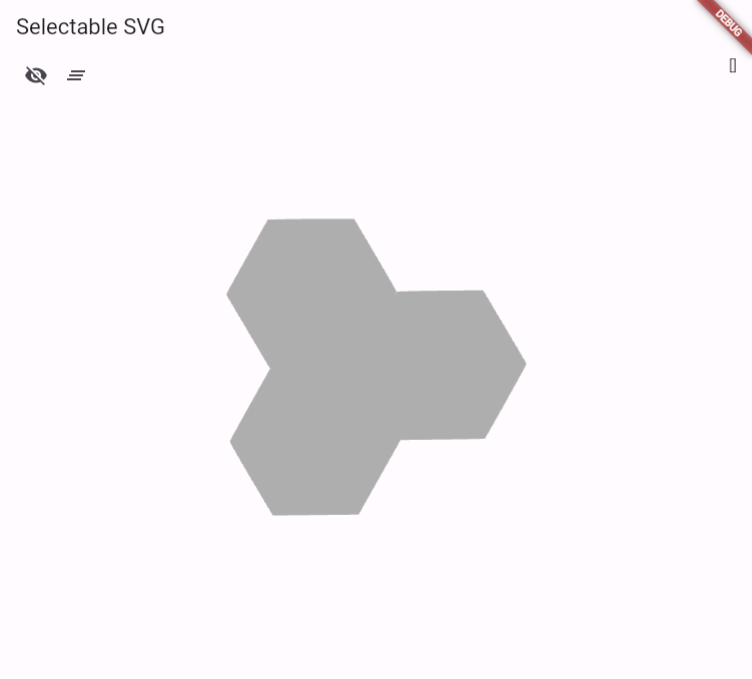
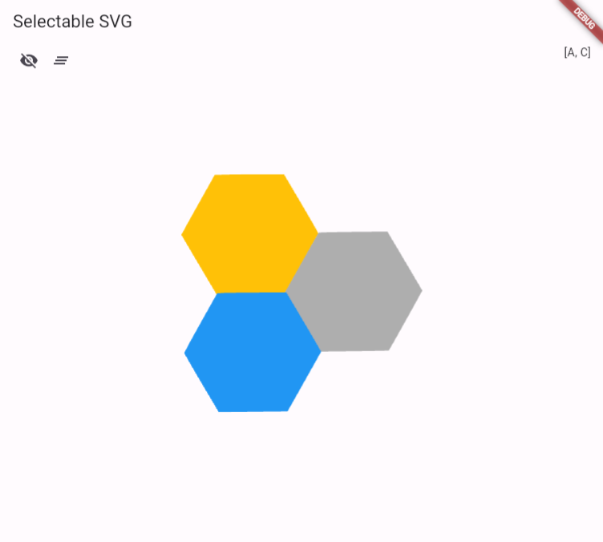

# Flutter Selectable SVG

This Flutter project demonstrates how to create a complex selectable structure using SVG.

 

## Overview

In this project, we've implemented a Flutter application that allows users to interact with SVG elements and select/deselect them dynamically.

## Features

- Select and deselect SVG elements by tapping/clicking on them.
- Toggle visibility of hit areas.
- Visual feedback for selected elements.

## Usage

1. Clone the repository.
2. Open the project in your preferred Flutter development environment.
3. Run the application on your device or emulator.